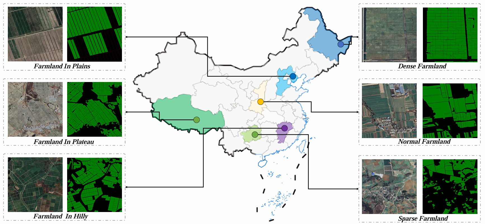

# DBBANet


The official implementation of **"A Comprehensive Deep-Learning Framework for Fine-Grained Farmland Mapping from High-Resolution Images"**.

We are delighted to share that our paper has been successfully accepted by the **IEEE Transactions on Geoscience and Remote Sensing (TGRS 2024)**.

This repository contains the full implementation of our model, including training and testing.

---

## 🌍Fine-Grained Farmland Dataset (FGFD)

We have developed a groundbreaking dataset encompassing diverse types of farmland, taking into account the varying terrain across China.



You can download the whole dataset via Baidu Disk:

- [Download Link](https://pan.baidu.com/s/1sxsG0gxLtvMEe4qREDRnew?pwd=FGFD)
  
  Code: `FGFD`

It is worth noting that when annotating the data, we labeled farmland without crops (in red) and farmland with crops (in green). However, in practical use, we are only concerned with distinguishing between farmland and non-farmland.

---

## 🏋️‍♀️ Training Instructions

We have provided a series of compared methods to estabish the benchmark.


| **Method Name** | **Description**                               |
|------------------|-----------------------------------------------|
| **UNet**         | UNet with ResNet-50 encoder for segmentation. |
| **DeeplabV3+**   | DeepLabV3+ with ResNet-50 encoder for segmentation. |
| **PSPNet**       | Pyramid Scene Parsing Network for semantic segmentation. |
| **HRNet**        | High-Resolution Network for fine-grained segmentation. |
| **ABCNet**       | Attentive Bilateral Contextual Network for Efficient Semantic Segmentation. |
| **CMTFNet**      | CNN and Multiscale Transformer Fusion Network for semantic segmentation. |
| **MCCANet**      | Boundary Supervision-Aided Multi scale Channelwise Cross Attention Network for semantic segmentation. |
| **CGNet**        | Context-Guided Network for efficient segmentation. |
| **DenseASPP**    | Densely connected Atrous Spatial Pyramid Pooling network. |
| **ENet**         | Efficient Neural Network for real-time semantic segmentation. |
| **SegNet**       | Encoder-decoder network for pixel-wise classification. |
| **BuildFormer**  | Specialized model for building segmentation tasks. |
| **UANet**        | Uncertainty-Aware Network with ResNet-50 for segmentation. |
| **DSNet**        | A Local–Global Dual-Stream Network for segmentation. |
| **UNetFormer**   | UNet-based model incorporating transformer layers. |
| **DBBANet**      | Dual-Branch Boundary-Aware Network for segmentation. |


To train the provoided models, follow these steps:

1. Set the hyperparameters for training.
2. Run the following command:

   ```bash
   python train.py --batchsize 32 --model_name DBBANet --gpu_id 0
   
---

## 🧪 Testing Instructions

To evaluate the trained model, follow these steps:

1. Ensure the model is properly trained and paths are set.
2. Run the following command:

   ```bash
   python test.py --model_name DBBANet --batchsize 32

---

## 📜 Citation

will come soon
